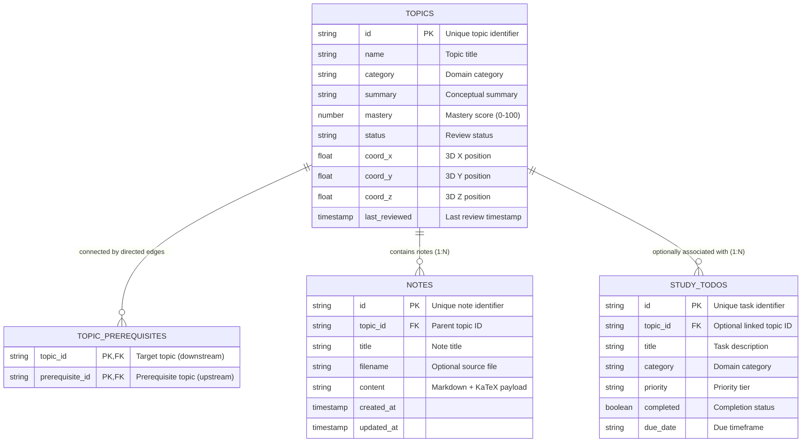

# Core Data Model & Design Decisions (`storage/data_model.md`)

This document defines the core data model extracted from the `study-app` frontend (`frontend/src/types/telemetry.ts` and `frontend/src/store/useStore.ts`) and records the architectural design decisions that govern how data is structured, related, and managed.

Following the principle of simplicity and minimalism, this model includes **only the 4 core entities currently used by the frontend**, strictly focusing on design decisions without unnecessary database implementation details.

---

## 1. Domain Entities & State Separation

The application state is partitioned into two distinct categories:
1. **Durable Domain Entities (Core Data Model)**: Concepts, graph relationships, notes, and study tasks that represent persistent knowledge and learning progress.
2. **Transient UI Telemetry (Client-Side Only)**: Viewport coordinates, camera position, hover targets, search queries, active category filters, HUD visibility, and visual post-processing effects (bloom/overload). These are ephemeral rendering states and are not part of the persistent data model.

```
+-------------------+           +-----------------------+
|      TOPICS       |<--------->|  TOPIC_PREREQUISITES  |
|  (Knowledge Node) |  (1 : N)  | (Directed Graph Edge) |
+-------------------+           +-----------------------+
        |
        | (1 : N)
        v
+-------------------+           +-----------------------+
|       NOTES       |           |      STUDY_TODOS      |
| (Markdown + Math) |           | (Actionable Task Item)|
+-------------------+           +-----------------------+
        ^                                   |
        |               (0..1 : N)          |
        +-----------------------------------+
```

### 1.1. `Topic` (Knowledge Node)
* **Frontend Type**: `TopicNode`
* **Role**: The foundational knowledge unit. Represents a discrete concept in the 3D knowledge cosmos (e.g., *Backpropagation & Autograd*).
* **Key Properties**:
  * `id`: Unique identifier (e.g., `TOPIC-001`).
  * `name`: Concise human-readable title.
  * `category`: Domain cluster (`AI & ML`, `CS`, `SYSTEMS`, `MATH`, `PHYSICS`, `CYBERSECURITY`, `ARCH`).
  * `summary`: High-level explanation of the concept.
  * `mastery`: User mastery level percentage ($0.00\% - 100.00\%$).
  * `status`: Spaced repetition lifecycle state (`NEW`, `LEARNING`, `DUE`, `MASTERED`).
  * `coordinates`: Fixed 3D Euclidean spatial position `[x, y, z]` for WebGL canvas rendering.
  * `last_reviewed`: Timestamp of the most recent review.

### 1.2. `TopicPrerequisite` (Graph Edge / Dependency)
* **Frontend Type**: `prerequisites: string[]` / `unlocks: string[]`
* **Role**: Represents directed connections between topics, forming the knowledge graph.
* **Key Properties**:
  * `topic_id`: The downstream concept requiring prior knowledge.
  * `prerequisite_id`: The upstream prerequisite concept.

### 1.3. `Note` (Attached Markdown Study Note)
* **Frontend Type**: `NoteItem`
* **Role**: Detailed study material, mathematical derivations, LaTeX/KaTeX equations, and code snippets attached to a topic.
* **Key Properties**:
  * `id`: Unique note identifier (e.g., `NOTE-001`).
  * `topic_id`: Reference to the parent `Topic`.
  * `title`: Header title of the note.
  * `filename`: Optional source filename or export identifier.
  * `content`: Full markdown payload.
  * `created_at` / `updated_at`: Revision timestamps.

### 1.4. `StudyTodo` (Actionable Study Task)
* **Frontend Type**: `StudyTodo`
* **Role**: Actionable study goals, review items, and spaced repetition tasks.
* **Key Properties**:
  * `id`: Unique task identifier (e.g., `TODO-001`).
  * `topic_id`: Optional reference linking the task to a specific knowledge node.
  * `title`: Description of the action item.
  * `category`: Domain category classification.
  * `priority`: Priority tier (`HIGH`, `MEDIUM`, `LOW`).
  * `completed`: Boolean completion status.
  * `due_date`: Due date string or target timestamp.

---

## 2. Entity Relationships



---

## 3. Core Architectural Design Decisions

### 3.1. Prerequisite Graph via a Dedicated Edge Entity
* **Decision**: Model prerequisite dependencies using a dedicated edge relationship (`topic_prerequisites`) rather than embedding array fields inside topics.
* **Rationale**:
  * In the frontend, graph relationships are viewed from two perspectives: **prerequisites** (ancestors needed before topic $X$) and **unlocks** (descendants unlocked by topic $X$).
  * A dedicated edge relationship acts as a single source of truth for both directions, avoiding synchronization anomalies.
  * Removing a topic cleanly cascades to its associated edges without requiring manual array filtering across other nodes.

### 3.2. Directed Graph Structure & Cycle Tolerance
* **Decision**: Model the graph as a general **Directed Knowledge Graph** with cycle-tolerant traversal algorithms, rather than enforcing an artificial strict DAG constraint.
* **Rationale**:
  * In knowledge networks, certain complementary topics have mutual associations (e.g. `GANs` $\leftrightarrow$ `VAEs` where both concepts reference and unlock each other as alternative generative models).
  * Traversal routines (BFS in `SceneCanvas` and topological sequencing in `TelemetryHUD`) use `visited` sets to ensure cycle-safe exploration without getting caught in infinite loops.

### 3.3. Separation of Markdown Notes from Topic Metadata
* **Decision**: Maintain `notes` as a separate 1-to-many child entity rather than nesting full markdown content directly inside topics.
* **Rationale**:
  * **Rendering Performance**: The 3D canvas requires only lightweight node metadata (`id`, `name`, `category`, `mastery`, coordinates) to render hundreds of nodes at 60 FPS.
  * **On-Demand Loading**: Notes can be large (containing code samples and mathematical formulas) and should only be loaded when the user opens the note viewer or inspector modal.

### 3.4. Loose Coupling for Study Tasks
* **Decision**: Allow `study_todos.topic_id` to be optional (nullable), preserving tasks if a referenced topic is deleted.
* **Rationale**:
  * Users frequently create general study tasks (e.g. "Review 15 Spaced Repetition cards") that do not correlate to a specific node in the graph.
  * If a topic node is removed or reorganized, the user's task history and to-do items remain intact rather than being unintentionally deleted.

### 3.5. Explicit 3D Coordinates
* **Decision**: Store spatial coordinates as explicit numeric `x, y, z` values.
* **Rationale**:
  * The frontend calculates collision relaxation and 3D positioning directly in Euclidean space. Storing explicit spatial values matches WebGL floating-point vertex buffers, avoids conversion overhead, and uses minimal storage.

---

## 4. Minimal Storage Policy

To maintain a lean and focused architecture:
* **No Speculative Entities**: The model excludes speculative tables (such as vector embeddings, crawl provenance, or separate review logs) that are not yet active in the frontend.
* **Evolution Principle**: Additional entities or schema extensions will be introduced only when corresponding functional requirements are actively added to the application.
