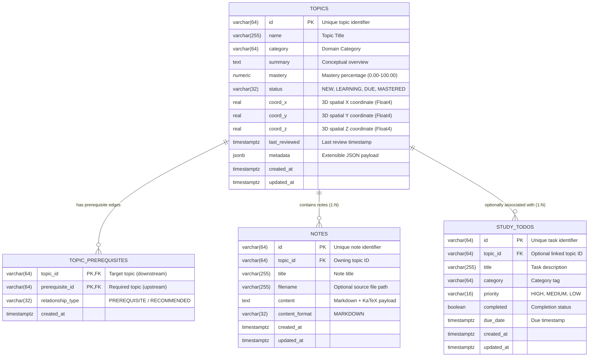

# Core Data Model Specification (`storage/data_model.md`)

This document defines the core data model extracted from the `study-app` frontend codebase (`frontend/src/types/telemetry.ts` and `frontend/src/store/useStore.ts`) and specifies how these entities map to persistent database storage (PostgreSQL). It documents the entity definitions, relationship cardinalities, relational database schemas, indexing strategies, integrity triggers, design justifications, and architectural considerations for future microservice extensibility (referencing Linear issue **FRO-3**).

---

## 1. System Context & Data Model Overview

The `study-app` platform is an interactive 3D knowledge cosmos and telemetry study companion. It visualizes over 220+ interconnected concepts in Artificial Intelligence, Computer Science, Distributed Systems, Mathematics, and Physics as a Directed Acyclic Graph (DAG) positioned in 3D Euclidean space.

### Core vs. Transient State Separation
When analyzing the application state, data is strictly bifurcated into:
1. **Persistent Domain Entities (Core Data Model)**: Entities representing durable knowledge concepts, graph topology dependencies, user learning progression, attached markdown notes, and actionable study tasks.
2. **Transient UI Telemetry (Client-Side Only)**: Ephemeral viewport and interaction states (e.g. `selectedTopicId`, `hoveredTopicId`, `searchQuery`, `selectedCategory`, `isInspectorOpen`, `hudVisible`, `isOverloaded`, `bloomIntensity`). These represent dynamic WebGL rendering states and are intentionally excluded from database persistence.

---

## 2. Core Entities

The domain model consists of **four primary entities**:

```
+-------------------+           +-----------------------+
|      TOPICS       |<--------->|  TOPIC_PREREQUISITES  |
|  (Knowledge Node) |  (1 : N)  |   (Directed Graph)    |
+-------------------+           +-----------------------+
        |
        | (1 : N)
        v
+-------------------+           +-----------------------+
|       NOTES       |           |      STUDY_TODOS      |
| (Markdown + Math) |           | (Actionable Task Item)|
+-------------------+           +-----------------------+
        ^                                   |
        |               (0..1 : N)          |
        +-----------------------------------+
```

### 2.1. `Topic` (Knowledge Node)
* **Frontend Representation**: `TopicNode`
* **Role**: The central knowledge unit within the application. Represents a discrete conceptual topic in the 3D cosmos.
* **Key Attributes**:
  * `id`: Unique topic identifier (e.g., `TOPIC-001` or UUID).
  * `name`: Concise human-readable title (e.g., `Backpropagation & Autograd`).
  * `category`: Domain cluster (`AI & ML`, `CS`, `SYSTEMS`, `MATH`, `PHYSICS`, `CYBERSECURITY`, `ARCH`).
  * `summary`: Conceptual overview of the topic.
  * `mastery`: Numeric recall/mastery percentage ($0.00\% - 100.00\%$).
  * `status`: Spaced repetition lifecycle state (`NEW`, `LEARNING`, `DUE`, `MASTERED`).
  * `coordinates`: Fixed 3D position `[x, y, z]` for spatial rendering in Three.js/WebGL.
  * `metadata`: Extensible JSON payload for future service integration (crawler origins, difficulty parameters).

### 2.2. `TopicPrerequisite` (Graph Edge / Dependency)
* **Frontend Representation**: `prerequisites: string[]` / `unlocks: string[]`
* **Role**: Models the Directed Acyclic Graph (DAG) topology that dictates learning sequences and knowledge unlocks ($A \rightarrow B$).
* **Key Attributes**:
  * `topic_id`: The target/downstream concept that requires prerequisite knowledge.
  * `prerequisite_id`: The source/upstream concept that must be understood first.
  * `relationship_type`: Dependency classification (e.g., `PREREQUISITE`, `RECOMMENDED`).

### 2.3. `Note` (Attached Markdown Study Note)
* **Frontend Representation**: `NoteItem`
* **Role**: Rich documentation, mathematical proofs, derivations, and code snippets attached to a specific topic node.
* **Key Attributes**:
  * `id`: Unique note identifier (e.g., `NOTE-001` or UUID).
  * `topic_id`: Foreign key referencing the parent `Topic`.
  * `title`: Header title of the note document.
  * `filename`: Optional source filename or export identifier.
  * `content`: Full markdown payload (supporting LaTeX/KaTeX math blocks and Prism code syntax).
  * `content_format`: Format identifier (`MARKDOWN`, `LATEX`, `PLAIN_TEXT`).
  * `created_at` / `updated_at`: Timestamp tracking for user revisions.

### 2.4. `StudyTodo` (Actionable Study Task)
* **Frontend Representation**: `StudyTodo`
* **Role**: High-priority study goals, spaced repetition reviews, and actionable tasks.
* **Key Attributes**:
  * `id`: Unique task identifier (e.g., `TODO-001`).
  * `topic_id`: Optional foreign key linking the task to a specific knowledge node.
  * `title`: Description of the action item.
  * `category`: Domain category classification.
  * `priority`: Priority tier (`HIGH`, `MEDIUM`, `LOW`).
  * `completed`: Boolean completion flag.
  * `due_date`: Target due timestamp with timezone (`TIMESTAMPTZ`).

---

## 3. Entity-Relationship Diagram (ERD)



---

## 4. Relational Database Schema (PostgreSQL Specification)

### 4.1. `topics` Table
Represents individual knowledge nodes rendered in the 3D cosmos view.

| Column | Type | Nullable | Constraints & Defaults | Description |
| :--- | :--- | :--- | :--- | :--- |
| `id` | `VARCHAR(64)` | NO | `PRIMARY KEY` | Unique topic identifier (e.g. `TOPIC-001` or UUID). |
| `name` | `VARCHAR(255)` | NO | `NOT NULL` | Human-readable title of the concept. |
| `category` | `VARCHAR(64)` | NO | `CHECK (category IN ('AI & ML', 'CS', 'SYSTEMS', 'MATH', 'PHYSICS', 'CYBERSECURITY', 'ARCH'))` | Domain category cluster. |
| `summary` | `TEXT` | NO | `DEFAULT ''` | Summary of the topic concept. |
| `mastery` | `NUMERIC(5,2)` | NO | `DEFAULT 0.00`, `CHECK (mastery >= 0.00 AND mastery <= 100.00)` | User mastery percentage ($0.00\% - 100.00\%$). |
| `status` | `VARCHAR(32)` | NO | `DEFAULT 'NEW'`, `CHECK (status IN ('NEW', 'LEARNING', 'DUE', 'MASTERED'))` | Spaced repetition lifecycle status. |
| `coord_x` | `REAL` | NO | `DEFAULT 0.0` | 3D coordinate X position in cosmos viewport (`FLOAT4`). |
| `coord_y` | `REAL` | NO | `DEFAULT 0.0` | 3D coordinate Y position in cosmos viewport (`FLOAT4`). |
| `coord_z` | `REAL` | NO | `DEFAULT 0.0` | 3D coordinate Z position in cosmos viewport (`FLOAT4`). |
| `last_reviewed` | `TIMESTAMPTZ` | YES | `DEFAULT CURRENT_TIMESTAMP` | Timestamp of the most recent user study review. |
| `metadata` | `JSONB` | NO | `DEFAULT '{}'::jsonb` | Extensible key-value storage for crawler/AI attributes. |
| `created_at` | `TIMESTAMPTZ` | NO | `DEFAULT CURRENT_TIMESTAMP` | Record creation timestamp. |
| `updated_at` | `TIMESTAMPTZ` | NO | `DEFAULT CURRENT_TIMESTAMP` | Record modification timestamp. |

**Indexes & Full-Text Search**:
```sql
CREATE INDEX idx_topics_category ON topics(category);
CREATE INDEX idx_topics_status ON topics(status);
CREATE INDEX idx_topics_metadata_gin ON topics USING gin(metadata);

-- Trigram Index for fuzzy autocomplete matching (requires pg_trgm extension)
CREATE EXTENSION IF NOT EXISTS pg_trgm;
CREATE INDEX idx_topics_name_trgm ON topics USING gin(name gin_trgm_ops);

-- Generated Full-Text Search Column & GIN Index
ALTER TABLE topics ADD COLUMN tsv_search tsvector
  GENERATED ALWAYS AS (to_tsvector('english', name || ' ' || coalesce(summary, ''))) STORED;
CREATE INDEX idx_topics_tsv ON topics USING gin(tsv_search);
```

---

### 4.2. `topic_prerequisites` Table
Models directed prerequisite edges between topics forming the learning DAG.

| Column | Type | Nullable | Constraints & Defaults | Description |
| :--- | :--- | :--- | :--- | :--- |
| `topic_id` | `VARCHAR(64)` | NO | `REFERENCES topics(id) ON DELETE CASCADE` | Downstream concept requiring prior knowledge. |
| `prerequisite_id` | `VARCHAR(64)` | NO | `REFERENCES topics(id) ON DELETE CASCADE` | Upstream prerequisite concept. |
| `relationship_type` | `VARCHAR(32)` | NO | `DEFAULT 'PREREQUISITE'` | Relationship classification (e.g. `PREREQUISITE`, `RECOMMENDED`). |
| `created_at` | `TIMESTAMPTZ` | NO | `DEFAULT CURRENT_TIMESTAMP` | Edge creation timestamp. |

**Constraints & DAG Cycle Prevention**:
```sql
ALTER TABLE topic_prerequisites ADD CONSTRAINT pk_topic_prerequisites PRIMARY KEY (topic_id, prerequisite_id);
ALTER TABLE topic_prerequisites ADD CONSTRAINT chk_prevent_self_loop CHECK (topic_id <> prerequisite_id);
CREATE INDEX idx_topic_prereq_prereq_id ON topic_prerequisites(prerequisite_id);

-- PostgreSQL Trigger to Prevent Multi-Hop Cyclic Dependencies (A -> B -> C -> A)
CREATE OR REPLACE FUNCTION check_prerequisite_cycle() RETURNS TRIGGER AS $$
BEGIN
  IF EXISTS (
    WITH RECURSIVE path AS (
      -- Start with the destination node
      SELECT NEW.topic_id AS current_node
      UNION
      -- Recursively traverse downstream dependent topics
      SELECT tp.topic_id
      FROM topic_prerequisites tp
      JOIN path p ON tp.prerequisite_id = p.current_node
    )
    SELECT 1 FROM path WHERE current_node = NEW.prerequisite_id
  ) THEN
    RAISE EXCEPTION 'Cyclic dependency rejected: Adding edge % -> % would create a cycle in the knowledge DAG.', NEW.prerequisite_id, NEW.topic_id;
  END IF;
  RETURN NEW;
END;
$$ LANGUAGE plpgsql;

CREATE TRIGGER trg_prevent_prereq_cycle
BEFORE INSERT OR UPDATE ON topic_prerequisites
FOR EACH ROW EXECUTE FUNCTION check_prerequisite_cycle();
```

---

### 4.3. `notes` Table
Contains rich markdown notes, mathematical proofs, and code examples attached to topics.

| Column | Type | Nullable | Constraints & Defaults | Description |
| :--- | :--- | :--- | :--- | :--- |
| `id` | `VARCHAR(64)` | NO | `PRIMARY KEY` | Unique note identifier (e.g. `NOTE-001` or UUID). |
| `topic_id` | `VARCHAR(64)` | NO | `REFERENCES topics(id) ON DELETE CASCADE` | Parent topic node ID. |
| `title` | `VARCHAR(255)` | NO | `NOT NULL` | Header title of the note. |
| `filename` | `VARCHAR(255)` | YES | | Optional source filename or export identifier. |
| `content` | `TEXT` | NO | `DEFAULT ''` | Full markdown payload with KaTeX equations. |
| `content_format` | `VARCHAR(32)` | NO | `DEFAULT 'MARKDOWN'` | Syntax format identifier (`MARKDOWN`, `LATEX`). |
| `created_at` | `TIMESTAMPTZ` | NO | `DEFAULT CURRENT_TIMESTAMP` | Note creation timestamp. |
| `updated_at` | `TIMESTAMPTZ` | NO | `DEFAULT CURRENT_TIMESTAMP` | Note modification timestamp. |

**Indexes & Full-Text Search**:
```sql
CREATE INDEX idx_notes_topic_id ON notes(topic_id);

-- Full-Text Search on note titles and markdown body content
ALTER TABLE notes ADD COLUMN tsv_search tsvector
  GENERATED ALWAYS AS (to_tsvector('english', title || ' ' || content)) STORED;
CREATE INDEX idx_notes_tsv ON notes USING gin(tsv_search);
```

---

### 4.4. `study_todos` Table
Tracks actionable study tasks, review goals, and practice items.

| Column | Type | Nullable | Constraints & Defaults | Description |
| :--- | :--- | :--- | :--- | :--- |
| `id` | `VARCHAR(64)` | NO | `PRIMARY KEY` | Unique task identifier (e.g. `TODO-001` or UUID). |
| `topic_id` | `VARCHAR(64)` | YES | `REFERENCES topics(id) ON DELETE SET NULL` | Optional associated knowledge topic node. |
| `title` | `VARCHAR(255)` | NO | `NOT NULL` | Description of the study task. |
| `category` | `VARCHAR(64)` | YES | | Domain category classification. |
| `priority` | `VARCHAR(16)` | NO | `DEFAULT 'MEDIUM'`, `CHECK (priority IN ('HIGH', 'MEDIUM', 'LOW'))` | Task priority tier. |
| `completed` | `BOOLEAN` | NO | `DEFAULT FALSE` | Task completion flag. |
| `due_date` | `TIMESTAMPTZ` | YES | | Target due timestamp. |
| `created_at` | `TIMESTAMPTZ` | NO | `DEFAULT CURRENT_TIMESTAMP` | Task creation timestamp. |
| `updated_at` | `TIMESTAMPTZ` | NO | `DEFAULT CURRENT_TIMESTAMP` | Task modification timestamp. |

**Indexes**:
```sql
CREATE INDEX idx_todos_topic_id ON study_todos(topic_id);

-- High-performance Partial Index for Open Tasks
CREATE INDEX idx_todos_open ON study_todos(priority, due_date) WHERE completed = FALSE;
```

---

## 5. Architectural Decisions & Justifications

### 5.1. Normalized Relational Design vs. Monolithic Document Store
* **Decision**: Decompose nodes, prerequisite edges, notes, and tasks into normalized relational tables instead of single nested JSON documents.
* **Justification**:
  * **Referential Integrity**: Foreign key constraints ensure notes and prerequisite links never point to deleted or non-existent topics.
  * **Payload Optimization for 60 FPS 3D Rendering**: The Three.js canvas requires only lightweight node metadata (`id`, `name`, `category`, `mastery`, `coord_x/y/z`, `status`) to render hundreds of nodes and particle streams at 60 FPS. Large markdown notes and todo lists can be loaded lazily on demand when the inspector or note modal is opened.
  * **Efficient Aggregations**: Enables instantaneous SQL queries for domain category mastery calculations (e.g., `AVG(mastery) WHERE category = 'AI & ML'`) and completion rates without unnesting large JSON structures.

### 5.2. Prerequisite DAG Modeling via Join Table
* **Decision**: Store prerequisite dependencies in a dedicated `topic_prerequisites` table rather than embedding array columns (e.g. `prerequisites text[]`) in `topics`.
* **Justification**:
  * In the frontend store, relationships are viewed bidirectionally: `prerequisites` (ancestors required before topic $X$) and `unlocks` (descendants unlocked by topic $X$).
  * A dedicated edge table ensures a single source of truth, avoiding dual-maintenance synchronization issues.
  * **Recursive CTEs**: Simplifies standard SQL recursive graph traversal for Kahn's topological sort and multi-tier transitive prerequisite resolution.
  * **Cycle Prevention**: Enables database-level multi-hop cycle rejection triggers to preserve strict DAG guarantees.

### 5.3. High-Performance Coordinate Types (`REAL / FLOAT4`)
* **Decision**: Store spatial coordinates as explicit `REAL` (`FLOAT4`) columns.
* **Justification**:
  * The frontend calculates collision relaxation and 3D positioning directly in Euclidean space. Using 4-byte `REAL` values matches WebGL floating-point buffers, saves 50% storage compared to `NUMERIC`, and eliminates conversion overhead.

### 5.4. Loose Coupling for Study Tasks (`ON DELETE SET NULL`)
* **Decision**: Make `study_todos.topic_id` nullable with `ON DELETE SET NULL`.
* **Justification**:
  * To-dos represent actionable user goals (e.g. "Review 15 Spaced Repetition cards"). Users may create general study tasks that do not correlate to any specific graph node.
  * If a topic node is removed or reorganized, the user's task history and to-do items remain intact rather than being unexpectedly deleted.

### 5.5. Extensible `metadata JSONB` for Microservice Evolution
* **Decision**: Include a `JSONB` metadata column on `topics`.
* **Justification**:
  * Supports future backend microservices (e.g., automated crawl systems, AI concept analyzers, vector embeddings) without requiring disruptive schema migrations.
  * Provides flexibility while retaining strict typed schema enforcement for all core application properties.

---

## 6. Microservice Evolution & Future System Compatibility

The extracted data model is structured to support decoupled backend microservices:

```
                                  +-----------------------+
                                  |    PostgreSQL Core    |
                                  | (topics, notes, DAG)  |
                                  +-----------------------+
                                              ^
                      +-----------------------+-----------------------+
                      |                                               |
           +--------------------+                           +--------------------+
           |    Crawl System    |                           | Intelligence System|
           |   (Microservice)   |                           |   (Microservice)   |
           +--------------------+                           +--------------------+
           | * Ingests docs     |                           | * pgvector vectors |
           | * Updates metadata |                           | * Auto-prereq AI   |
           | * Syncs references |                           | * Spaced Repetition|
           +--------------------+                           +--------------------+
```

### 6.1. Crawl & Ingestion System
* **Function**: Scrapes and indexes external documentation, tutorials, and research papers.
* **Schema Extension**: Ingests structured references into `topics.metadata`:
  ```json
  {
    "sources": [
      {
        "url": "https://arxiv.org/abs/1706.03762",
        "title": "Attention Is All You Need",
        "scraped_at": "2026-08-23T14:30:00Z",
        "content_hash": "sha256:e3b0c442..."
      }
    ],
    "difficulty_rating": 4.2
  }
  ```

### 6.2. Intelligence System & Semantic Search (`pgvector`)
* **Function**: Powers semantic concept search and AI-assisted prerequisite discovery.
* **Schema Extension (`pgvector` DDL)**:
  ```sql
  CREATE EXTENSION IF NOT EXISTS vector;

  -- 1536-dimensional OpenAI / Voyage embeddings table for topic semantics
  CREATE TABLE topic_embeddings (
    topic_id VARCHAR(64) PRIMARY KEY REFERENCES topics(id) ON DELETE CASCADE,
    embedding vector(1536) NOT NULL,
    model_version VARCHAR(64) DEFAULT 'text-embedding-3-small',
    updated_at TIMESTAMPTZ DEFAULT CURRENT_TIMESTAMP
  );

  -- High-Speed HNSW Cosine Index for Approximate Nearest Neighbor (ANN) search
  CREATE INDEX idx_topic_embeddings_hnsw ON topic_embeddings USING hnsw (embedding vector_cosine_ops);
  ```

### 6.3. Spaced Repetition System (FSRS / SM-2 Engine)
* **Function**: Computes dynamic review intervals and optimal spaced repetition recall curves.
* **Schema Extension (`topic_reviews` table)**:
  ```sql
  CREATE TABLE topic_reviews (
    id UUID PRIMARY KEY DEFAULT gen_random_uuid(),
    topic_id VARCHAR(64) REFERENCES topics(id) ON DELETE CASCADE,
    rating SMALLINT NOT NULL CHECK (rating BETWEEN 1 AND 4), -- 1=Again, 2=Hard, 3=Good, 4=Easy
    stability REAL NOT NULL,                                  -- Memory stability (days)
    difficulty REAL NOT NULL,                                 -- Concept difficulty (1.0-10.0)
    elapsed_days REAL NOT NULL,
    scheduled_days REAL NOT NULL,
    reviewed_at TIMESTAMPTZ DEFAULT CURRENT_TIMESTAMP
  );
  CREATE INDEX idx_topic_reviews_topic ON topic_reviews(topic_id, reviewed_at DESC);
  ```

### 6.4. Multi-Tenant Progression Separation
For multi-user cloud synchronization, canonical curriculum data (topics, DAG edges) separates from user progression via a `user_topic_progress` table:
```sql
CREATE TABLE user_topic_progress (
  user_id UUID NOT NULL,
  topic_id VARCHAR(64) NOT NULL REFERENCES topics(id) ON DELETE CASCADE,
  mastery NUMERIC(5,2) DEFAULT 0.00 CHECK (mastery >= 0.00 AND mastery <= 100.00),
  status VARCHAR(32) DEFAULT 'NEW' CHECK (status IN ('NEW', 'LEARNING', 'DUE', 'MASTERED')),
  last_reviewed TIMESTAMPTZ DEFAULT CURRENT_TIMESTAMP,
  PRIMARY KEY (user_id, topic_id)
);
```
